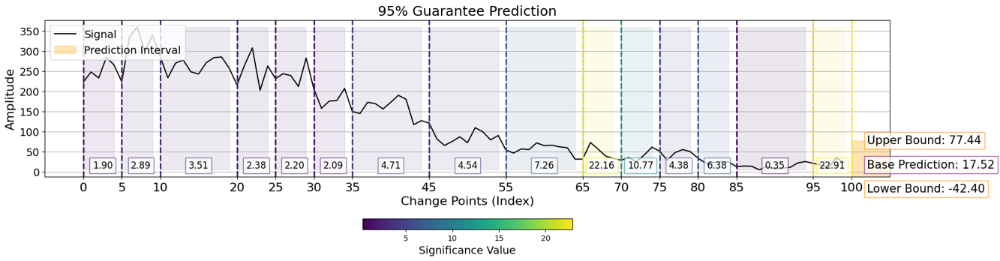
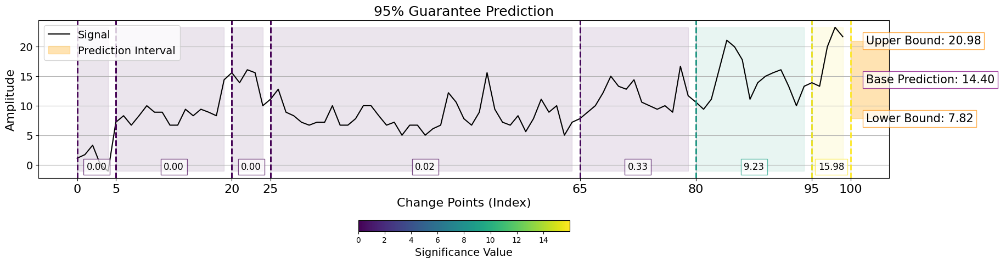

# ConformaSegment Time-Series Explainer Package 📦


<p align="center">
  <strong>Click here to listen to the <em>ConformaSegment PODCAST</em> produced by AI.</strong>
</p>
<p align="center">
  <a href="https://notebooklm.google.com/notebook/adfb56b4-f171-4c69-b03e-0cf9074fcbae/audio">
    
  </a>
</p>


### Introduction

ConformaSegment is an innovative framework built on conformal prediction, designed to generate robust and interpretable interval-based explanations for time-series forecasting—without relying on specific data distributions. 
By identifying time intervals that significantly influence whether actual values fall within predicted confidence bounds, the framework sheds light on the model’s decision-making process. The presence of such impactful intervals indicates their essential role in shaping predictive confidence. 
Thus, effective explainability demands not only pinpointing these key periods but also understanding how fluctuations in uncertainty alter forecasting outcomes. 
ConformaSegment addresses these challenges by emphasizing the most crucial intervals, providing insights that enhance both reliability and interpretability.

For feature importance analysis, we implemented the function get_feature_importance(), which takes several key inputs: a trained model, a sample x_test, alpha, which sets the conformal prediction error rate, calibration datasets, and a penalty parameter for the Pruned Exact Linear Time change point detection algorithm.

```python
import ConformaSegment as cs
# Prepare independent and target variables  
features, target = df.drop(columns=["target"]), df["target"]  

# Split data into training, testing, and calibration sets  
X_train, X_eval, X_ref, y_train, y_eval, y_ref = data_split(features, target, split_rate=0.5, stratify=target)  

# Define and train the model  
model = make_lstm().fit(X_train, y_train)  

# Set parameters for feature importance analysis  
instance_idx = 165  # Index of the selected instance  
instance = X_eval[instance_idx]  
error_margin = 0.05  # Conformal prediction error rate  
pelt_penalty = 4  # PELT change point detection penalty  

# Compute feature importance for the selected instance  
cs.get_feature_importance(model, instance, X_ref, y_ref, error_margin, pelt_penalty)  

```

The above code generates the following visual output. The algorithm evaluates segments based on their contribution to model uncertainty and, consequently, the model's decision. This allows for an interpretation of the time series, highlighting which segments are more influential in the model's decision-making process.



Another output sample can be found as below.




The orange highlight represents the confidence interval, which is guaranteed to contain the correct value based on the user-specified coverage rate.

### Contributing

The code is produced with the fund provided by the University of Bologna.

<b>Author<b/> <br/>
Fatima Rabia Yapicioglu <br/>

Copyright 2025 UNIBO. All rights reserved.

This software is proprietary and confidential. Unauthorized copying, modification, distribution, sublicensing, or use of this code, in whole or in part, without explicit written permission from the author is strictly prohibited.

This software may not be reverse-engineered, decompiled, or disassembled. Violators will be subject to legal action.

For licensing inquiries, contact fatima.yapicioglu2@unibo.it.

This software can be used for academic and research purposes, if you use the package please cite the correct paper indicated in the website url of this repository.
